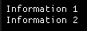
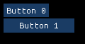
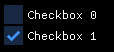
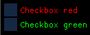
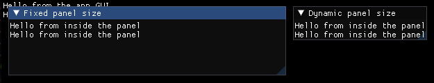

# Items
**ImGui Items:**
- [ImWindow](#ImWindow)
- [ImText](#ImText)
- [ImTextColored](#ImTextColored)
- [ImButton](#ImButton)
- [ImCheckbox](#ImCheckbox)
- [ImChild](#ImChild)
- [ImGroup](#ImGroup)
- [ImSameLine](#ImSameLine)
- [ImDummy](#ImDummy)
- [ImSeparator](#ImSeparator)
- [ImSpacing](#ImSpacing)

**Other:**
- [Container](#Container)

</br>

---

</br>

## Experimental
**Widgets (Experimental):**
- [Text](#Text)
- [Button](#Button)
- [Checkbox](#Checkbox)

**Views (Experimental):**
- [LineView](#LineView)

**Styles (Experimental):**
- [Theme](#Theme)
- [TextStyle](#TextStyle)
- [ButtonStyle](#ButtonStyle)
- [CheckboxStyle](#CheckboxStyle)
- [PanelStyle](#PanelStyle)

**Other (Experimental):**
- [Panel](#Panel)

</br>

# ImGui Items
Items with very small wrappers over the ImGui items, mostly without new features. If further information is required for the items, the documentation from ImGui itself can also be used. \
Note that the current implementation only implements the bare minimum. Many attributes and features of the items are still missing.
## ImWindow
### Description:
Implementation of `ImGui::Begin` and `ImGui::End`.
### Attributes:
| Name | Type | Description | Default Value |
| ---| --- | --- | --- |
| name | String | The title of the window. | "##<object_address>" *(Will be displayed as an empty string)* |
### Implemented API functions:
| Function | Description |
| --- | --- |
| ```bool IsItemPressed()``` | Returns true if the window or any of its child items is pressed by the user. |
| ```bool IsItemHovered()``` | Returns true if the window or any of its child items is hovered by the user. |
### Example:
```
// example.igm:

ImWindow : window_0
{
    name = "Panel title"

    ImText
    {
        text = "Hello world"
    }
}
```


---
## ImText
### Description:
Implementation of `ImGui::Text`.
### Attributes:
| Name | Type | Description | Default Value |
| ---| --- | --- | --- |
| text | String | The text that will be displayed. | "" |
### Implemented API functions:
| Function | Description |
| --- | --- |
| ```bool IsItemPressed()``` | Returns true if the text is pressed by the user. |
| ```bool IsItemHovered()``` | Returns true if the text is hovered by the user. |
### Example:
```
// example.igm:

ImText { text = "Hello world 1" }
ImText { text = "Hello world 2" }
```


---
## ImTextColored
### Description:
Implementation of `ImGui::TextColored`.
### Attributes:
| Name | Type | Description | Default Value |
| ---| --- | --- | --- |
| text | String | The text that will be displayed. | "" |
| color | Vec4 | The color of the text. | The global text color is used. |
### Implemented API functions:
| Function | Description |
| --- | --- |
| ```bool IsItemPressed()``` | Returns true if the text is pressed by the user. |
| ```bool IsItemHovered()``` | Returns true if the text is hovered by the user. |
### Example:
```
// example.igm:

ImTextColored { text = "Text red" color = (1.0, 0.0, 0.0, 1.0) }
ImTextColored { text = "Text green" color = (0.0, 1.0, 0.0, 1.0) }
```


---
## ImButton
### Description:
Implementation of `ImGui::Button`.
### Attributes:
| Name | Type | Description | Default Value |
| ---| --- | --- | --- |
| text | String | The text that appears inside the button. | "" |
| size | Vec2 | The size of the button. A value of 0 on the axis allows the button to be dynamically resized to this axis. | (0, 0) |
### Implemented API functions:
| Function | Description |
| --- | --- |
| ```bool IsItemPressed()``` | Returns true if the button is pressed by the user. |
| ```bool IsItemHovered()``` | Returns true if the button is hovered by the user. |
### Example:
```
// example.igm:

ImButton { text = "Button dynamic size" }
ImButton { text = "Button fixed size" size = (170, 25) }
```


---
## ImCheckbox
### Description:
Implementation of `ImGui::Checkbox`.
### Attributes:
| Name | Type | Description | Default Value |
| ---| --- | --- | --- |
| text | String | The text that appears next to the checkbox. | "" |
### Implemented API functions:
| Function | Description |
| --- | --- |
| ```bool IsItemPressed()``` | Returns true if the checkbox is pressed by the user. |
| ```bool IsItemHovered()``` | Returns true if the checkbox is hovered by the user. |
| ```bool IsCheckboxChecked()``` | Returns the state of the checkbox. |
### Example:
```
// example.igm:

ImCheckbox { text = "Checkbox 1" }
ImCheckbox { text = "Checkbox 2" }
```


---
## ImChild
### Description:
Implementation of `ImGui::BeginChild` and `ImGui::EndChild`.
### Attributes:
| Name | Type | Description | Default Value |
| ---| --- | --- | --- |
| id | String | The id of the child window. | "##<object_address>" *(Will be displayed as an empty string)* |
| size | Vec2 | The size of the child window. | (0, 0) |
| border | Bool | Specifies whether to draw a border around the child window. | False |
### Implemented API functions:
| Function | Description |
| --- | --- |
| ```bool IsItemPressed()``` | Returns true if the child window or any of its child items is pressed by the user. |
| ```bool IsItemHovered()``` | Returns true if the child window or any of its child items is hovered by the user. |
### Example:
```
// example.igm:

ImText { text = "Outside of the child window" }
ImChild
{
    size = (200, 200)
    border = "true"

    ImText { text = "Inside of the child window" }
    ImText { text = "Inside of the child window" }
}
ImText { text = "Outside of the child window" }
```


---
## ImGroup
### Description:
Implementation of `ImGui::BeginGroup` and `ImGui::EndGroup`.
### Attributes:
*The group currently does not have any attributes.*
### Implemented API functions:
| Function | Description |
| --- | --- |
| ```bool IsItemPressed()``` | Returns true if the group or any of its child items is pressed by the user. |
| ```bool IsItemHovered()``` | Returns true if the group or any of its child items is hovered by the user. |
### Example:
```
// example.igm:

ImText { text = "Outside of the group 1" }
ImGroup
{
    ImButton { text = "Inside of the group 1" }
    ImButton { text = "Inside of the group 2" }
    ImButton { text = "Inside of the group 3" }
    ImSameLine { }
    ImButton { text = "Inside of the group 4" }
}
ImSameLine { }
ImText { text = "Outside of the group 2" }
ImText { text = "Outside of the group 3" }
```


---
## ImSameLine
### Description:
Implementation of `ImGui::SameLine`.
### Attributes:
| Name | Type | Description | Default Value |
| ---| --- | --- | --- |
| offset_from_start_x | Float |  offset_from_start_x == 0 : follow right after previous item <br/> offset_from_start_x != 0 : align to specified x position (relative to window/group left)  | 0.0f  |
| spacing | Float | spacing_w < 0 : use default spacing if pos_x == 0, no spacing if pos_x != 0 <br/> spacing_w >= 0 : enforce spacing amount | -1.0f |
### Implemented API functions:
*ImSameLine does not have any implemented API functions.*
### Example:
```
// example.igm:

ImButton { text="Hello world" }

ImButton { text="Hello world" }
ImSameLine { spacing = 10 }
ImButton { text="Hello world" }

ImButton { text="Hello world" }
```


---
## ImDummy
### Description:
Implementation of `ImGui::Dummy`.
### Attributes:
| Name | Type | Description | Default Value |
| ---| --- | --- | --- |
| size | Vec2 | The size of the dummy  | 0.0f  |
### Implemented API functions:
| Function | Description |
| --- | --- |
| ```bool IsItemPressed()``` | Returns true if the dummy or any of its child items is pressed by the user. |
| ```bool IsItemHovered()``` | Returns true if the dummy or any of its child items is hovered by the user. |
### Example:
```
// example.igm:

ImButton { text="Hello world" }

ImDummy { size=(10, 50) }

ImButton { text="Hello world" }
```


---
## ImSeparator
### Description:
Implementation of `ImGui::Separator`.
### Attributes:
*The separator currently does not have any attributes.*
### Implemented API functions:
| Function | Description |
| --- | --- |
| ```bool IsItemPressed()``` | Returns true if the separator or any of its child items is pressed by the user. |
| ```bool IsItemHovered()``` | Returns true if the separator or any of its child items is hovered by the user. |
### Example:
```
// example.igm:

ImButton { text="Hello world" }

ImSeparator { }

ImButton { text="Hello world" }
```


---
## ImSpacing
### Description:
Implementation of `ImGui::Spacing`.
### Attributes:
*The separator currently does not have any attributes.*
### Implemented API functions:
*ImSpacing currently does not have any implemented API functions.*
### Example:
```
// example.igm:

ImButton { text="Hello world" }

ImSpacing { }
ImSpacing { }
ImSpacing { }

ImButton { text="Hello world" }
```


# Other
## Container
### Description:
The container is used to store custom data. It cannot currently have any child items.
### Attributes:
*The container currently does not have any attributes.*
### Example:
```
// example.igm:

Container : container_0
{
    +string value_0 = "Value 0"
    +string value_1 = "Value 1"
    +string value_2 = "Value 2"
}

LineView
{
    padding = 2

    Text { text = container_0.value_0  }  // Copy by value
    Text { text = container_0.value_1  }  // Copy by value
    Text { text = @container_0.value_2 }  // Copy by reference
}
```


# Experimental
The following items are experimental items that represent own implementations of different items. The experimental ones are intended to show the more complex structure and show how the layer could be built up in the future. However, the items are far from complete and don't integrate well with the fairly simple ImGui wrapper items listed above.
# Widgets (Experimental)
## Text
### Description:
The text is equal to ```ImGui::Text()``` and is used to display basic information.
### Attributes:
| Name | Type | Description | Default Value |
| ---| --- | --- | --- |
| text | String | The text that will be displayed. | "" |
| position | Vector2 | Overrides the position specified by the parent item. | Position specified by the parent item is used. |
| size | Vector2 | Overrides the size specified by the parent item. | Size specified by the parent item is used. |
| margin | Margin | Sets the space around the item. | (0, 0, 0, 0) |
### Implemented API functions:
| Function | Description |
| --- | --- |
| ```bool IsItemPressed()``` | Returns true if the Text is pressed by the user. |
| ```bool IsItemHovered()``` | Returns true if the Text is hovered by the user. |
### Example:
```
// example.igm

LineView
{
    padding = 5
    spacing = 1

    Text { text="Information 1" }
    Text { text="Information 2" }
}
```


---
## Button
### Description:
The button is equal to ```ImGui::Button()```.
### Attributes:
| Name | Type | Description | Default Value |
| --- | --- | --- | --- |
| text | String | The text that is displayed inside the button. | "" |
| position | Vector2 | Overrides the position specified by the parent item. | Position specified by the parent item is used. |
| size | Vector2 | Overrides the size specified by the parent item. | Size specified by the parent item is used. |
| margin | Margin | Sets the space around the item. | (0, 0, 0, 0) |
### Implemented API functions:
| Function | Description |
| --- | --- |
| ```bool IsItemPressed()``` | Returns true if the button is pressed by the user. |
| ```bool IsItemHovered()``` | Returns true if the button is hovered by the user. |
### Example:
```
// example.igm

LineView
{
    padding = 5
    spacing = 2

    Button : button_0 { text="Button 0" }
    Button : button_1 { text="Button 1" size=(100, 20) }
}
```
```cpp
// example.cpp

if (gui::IsItemPressed(unit, "button_0"))
    std::cout << "Button 0 is pressed" << std::endl;

if (gui::IsItemHovered(unit, "button_1"))
    std::cout << "Button 1 is pressed" << std::endl;
```


---
## Checkbox
### Description:
The checkbox is equal to ```ImGui::Checkbox()```.
### Attributes:
| Name | Type | Description | Default Value |
| ---| --- | --- | --- |
| text | String | Text that is displayed next to the checkbox. | "" |
| checked | Bool | Sets the state of the checkbox on startup. | False |
| position | Vector2 | Overrides the position specified by the parent item. | Position specified by the parent item is used. |
| size | Vector2 | Overrides the size specified by the parent item. | Size specified by the parent item is used. |
| margin | Margin | Sets the space around the item. | (0, 0, 0, 0) |
### Implemented API functions:
| Function | Description |
| --- | --- |
| ```bool IsItemPressed()``` | Returns true if the checkbox or its text is pressed by the user. |
| ```bool IsItemHovered()``` | Returns true if the checkbox or its text is hovered by the user. |
| ```bool IsCheckboxChecked()``` | Returns the state of the checkbox. |
### Example:
```
// example.igm:

LineView
{
    padding = 5
    spacing = 2

    Checkbox : checkbox_0 { text="Checkbox 0" }
    Checkbox : checkbox_1 { text="Checkbox 1" checked=true }
}

```
```cpp
// example.cpp

if (gui::IsCheckboxChecked(file, "checkbox_0"))
    std::cout << "checkbox_0 is checked" << std::endl;

if (gui::IsCheckboxChecked(file, "checkbox_1"))
    std::cout << "checkbox_1 is checked" << std::endl;
```



# Views (Experimental)
## LineView
### Description:
The LineView is there to implement the basic alignment of ImGui. Child items are stacked either on the horizontal axis or on the vertical axis. All child items in the LineView have a fully dynamic size; The LineView does not specify a size, even if it has itself received a fixed size from the parent item.
### Attributes:
| Name | Type | Description | Default Value |
| ---| --- | --- | --- |
| orientation | Orientation | Specifies on which access the child items will be stacked. | "Vertical" |
| spacing | Int | Sets the spacing between each child item. | 0 |
| position | Vector2 | Overrides the position specified by the parent item. | Position specified by the parent item is used. |
| size | Vector2 | Overrides the size specified by the parent item. | Size specified by the parent item is used. |
| margin | Margin | Sets the space around the item. | (0, 0, 0, 0) |
### Example:
```
// example.igm:

Panel
{
    title = "LineView example"

    LineView
    {
        spacing = 2.5
        padding = 20

        Checkbox { text = "Checkbox 0" }
        Checkbox { text = "Checkbox 1" checked = true }
        Checkbox { text = "Checkbox 2" checked = false }

        LineView
        {
            orientation = "Horizontal"
            spacing = 2.5

            Button { text = "Button 0" }
            Button { text = "Button 1" }
            Button { text = "Button 2" }
        }

        Button { text = "Button 3" }
        Button { text = "Button 4" }

        Text { text = "Text 0" }
        Text { text = "Text 1" }
        Text { text = "Text 2" }
    }
}

```


# Styles (Experimental)
## Theme
### Description:
The theme is used to create themes from various style items and then apply them to a specific unit.
### Restrictions:
- Can only be created in the global scope of an unit
### Attributes:
| Name | Type | Description | Default Value |
| --- | --- | --- | --- |
| name | String | The name of the theme. | "" |
### Example:
```
// themes.igm:

Theme : dark  // ID used to reference the theme from the backend
{
    name = "Dark theme"

    TextStyle
    {
        color = (1.0, 0.0, 0.0, 1.0)
    }

    ButtonStyle
    {
        color = (1.0, 0.0, 0.0, 1.0)
    }
}

Theme : light
{
    name = "Light theme"

    /* ... */
}
```
```
// app.igm:

LineView
{
    spacing = 3
    padding = 5

    Text { text = "Hello world" }
    Button { text = "Hello world" }

    Text
    {
        text = "Blue text"

        // Overwrites the style from the theme
        TextStyle
        {
            color = (0.0, 0.0, 1.0, 1.0)
        }
    }
}
```
```cpp
// main.cpp:
const size_t app_ui = igm::ParseFromFile("app.igm");
const size_t themes = igm::ParseFromFile("themes.igm");

// Apply theme to the app_ui unit
igm::InitUnitTheme(app_ui, themes, "dark");
```


---
## TextStyle
### Description:
Used to style the item `Text`. Can only be placed in an item of type `Text` or `Theme`.
### Restrictions:
- Can only be created in an item of type `Text` or `Theme`
- Cannot be created in the global scope of a unit
### Attributes:
| Name | Type | Description | Default Value |
| --- | --- | --- | --- |
| color | Color | The default color of the text. | The global text color is used. |
| color_hovered | Color | The color of the text when it is hovered. | The global text color is used. |
| color_active | Color | The color of the text when it is pressed. | The global text color is used. |
### Example:
```
// example.igm

LineView
{
    padding = 5
    spacing = 2

    Text
    {
        text = "Hello world red"

        TextStyle
        {
            color = (1.0, 0.0, 0.0, 1.0)
        }
    }

    Text
    {
        text = "Hello world green"

        TextStyle
        {
            color = (0.0, 1.0, 0.0, 1.0)
        }
    }
}
```


---
## ButtonStyle
### Description:
Used to style the item `Button`. Can only be placed in an item of type `Button` or `Theme`.
### Restrictions:
- Can only be created in an item of type `Button` or `Theme`
- Cannot be created in the global scope of a unit
### Attributes:
| Name | Type | Description | Default Value |
| --- | --- | --- | --- |
| color | Color | The default color of the button. | The global button color is used. |
| color_hovered | Color | The color of the button when it is hovered. | The global button color is used. |
| color_active | Color | The color of the button when it is pressed. | The global button color is used. |
| text_color | Color | The default color of the text inside the button. | The global text color is used. |
| text_color_hovered | Color | The color of the text inside the button when it is hovered. | The global text color is used. |
| text_color_active | Color | The color of the text inside the button when it is pressed. | The global text color is used. |
### Example:
```
// example.igm

LineView
{
    padding = 5
    spacing = 2

    Button
    {
        text = "Button red"

        ButtonStyle
        {
            color = (1.0, 0.0, 0.0, 1.0)
            text_color = (0.0, 1.0, 0.0, 1.0)
        }
    }

    Button
    {
        text = "Button green"

        ButtonStyle
        {
            color = (0.0, 1.0, 0.0, 1.0)
            text_color = (1.0, 0.0, 0.0, 1.0)
        }
    }
}
```


---
## CheckboxStyle
### Description:
Used to style the item `Checkbox`. Can only be placed in an item of type `Checkbox` or `Theme`.
### Restrictions:
- Can only be created in an item of type `Checkbox` or `Theme`
- Cannot be created in the global scope of a unit
### Attributes:
| Name | Type | Description | Default Value |
| --- | --- | --- | --- |
| text_color | Color | The default color of the text of the checkbox. | The global text color is used. |
| text_color_hovered | Color | The color of the text of the checkbox when it is hovered. | The global text color is used. |
| text_color_active | Color | The color of the text of the checkbox when it is pressed. | The global text color is used. |
### Example:
```
// example.igm

LineView
{
    padding = 5
    spacing = 2

    Checkbox
    {
        text = "Checkbox red"

        CheckboxStyle
        {
            text_color = (1.0, 0.0, 0.0, 1.0)
        }
    }

    Checkbox
    {
        text = "Checkbox green"

        CheckboxStyle
        {
            text_color = (0.0, 1.0, 0.0, 1.0)
        }
    }
}
```


---
## PanelStyle
### Description:
Used to style the item `Panel`. Can only be placed in an item of type `Panel` or `Theme`.
### Restrictions:
- Can only be created in an item of type `Panel` or `Theme`
- Cannot be created in the global scope of a unit
### Attributes:
| Name | Type | Description | Default Value |
| --- | --- | --- | --- |
| color | Color | The default background color of the panel. | The global panel color is used. |
| color_hovered | Color | The default background color of the panel when it is hovered. | The global panel color is used. |
| color_active | Color | The default background color of the panel when it is pressed. | The global panel color is used. |
### Example:
```
// example.igm

Panel
{
    title = "Panel blue"
    position = (5, 5)
    size = (120, 40)

    LineView
    {
        spacing = 3
        padding = 5

        Text { text = "Hello world" }
    }

    PanelStyle
    {
        color = (0.0, 0.0, 1.0, 1.0)
    }
}

Panel
{
    title = "Panel green"
    position = (5, 60)
    size = (120, 40)

    LineView
    {
        spacing = 3
        padding = 5

        Text { text = "Hello world" }
    }

    PanelStyle
    {
        color = (0.0, 1.0, 0.0, 1.0)
    }
}
```


# Other (Experimental)
## Panel
### Description:
For the markup language, the purpose of panels are to have small panels that are rendered above the app GUI that can be moved and resized by the user.
Each child item is assigned the position (0, 0) and the size is set to the size of the panel. If the size of the panel is dynamic, the child sizes are also dynamic and the panel adapts to the actual size of the child items. However, this only happens in the first frame. After the first frame, the size is determined by the panel again. Resizing child items then no longer has any effect on the panel itself.
Since all child items get the position (0,0) and are overlapped, it often makes sense to only have a view as a child item. Panels are ignored by all views; putting a panel inside a view has no effect.

The panels are nothing more than an implementation of the ImGui windows.
In the markup language, the windows are named panels, since the item 'Window' may be used for a different purpose in the future.
While in ImGui widgets can only be created inside a ImGui window, it is possible here to create widgets from the Markup Language without a ImGui window and render them directly in the app window. Internally, however, the drawing on the app window only works via a default root ImGui window that is created for each unit ;)
### Attributes:
| Name | Type | Description | Default Value |
| --- | --- | --- | --- |
| title | String | The title of the panel. Note that the title will be changed to ```<title>##<item_address>``` internally to ensure a unique ID. However, only ```<title>``` is displayed in the GUI. | "##<item_address>", which is displayed as an empty string. |
| position | Vector2 | The start position of the panel, relative to the app window.| Dynamic position based on the other panels. |
| size | Vector2 | The start size of the panel. | Dynamic size based on the panel's child items. |
### Implemented API functions:
| Function | Description |
| --- | --- |
| ```bool IsItemPressed()``` | Returns true if the panel or any of its child items is pressed by the user. |
| ```bool IsItemHovered()``` | Returns true if the panel or any of its child items is hovered by the user. |
### Example:
```
// example.igm:

LineView
{
    padding = 2

    Text { text="Hello from the app GUI" }
    Text { text="Hello from the app GUI" }
}

Panel
{
    title = "Fixed panel size"
    position = (10, 10)
    size = (400, 100)

    LineView
    {
        padding = 2

        Text { text="Hello from inside the panel"}
        Text { text="Hello from inside the panel"}
    }
}

Panel
{
    title = "Dynamic panel size"
    position = (420, 10)

    LineView
    {
        padding = 2

        Text { text="Hello from inside the panel"}
        Text { text="Hello from inside the panel"}
    }
}
```

